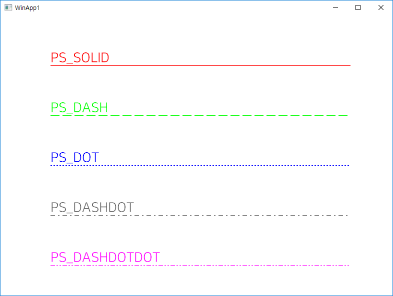

# GDI Pen
최근 GDI 오브젝트를 이용하면서 정리한 내용들입니다. 개인적으로 정리하고자 쓴 글이라 반말(?)입니다. 양해 부탁드립니다.

## 1. 펜의 종류
GDI 오브젝트 중 하나인 펜(Pen)은 ([`CreatePen`](https://docs.microsoft.com/en-us/windows/desktop/api/wingdi/nf-wingdi-createpen)) 함수로 여러가지 스타일(`PS_`로 시작하는 상수 값)을 지정하여 생성할 수 있음.

```c++
HPEN g_aPens[5];
COLORREF g_aColors[5];

int APIENTRY wWinMain(
    HINSTANCE hInstance,
    HINSTANCE /*hPrevInstance*/,
    LPWSTR /*pszCmdLine*/,
    int nCmdShow)
{
    // ...
    g_aColors[0] = RGB(255, 0, 0);
    g_aColors[1] = RGB(0, 255, 0);
    g_aColors[2] = RGB(0, 0, 255);
    g_aColors[3] = RGB(100, 100, 100);
    g_aColors[4] = RGB(255, 0, 255);

    g_aPens[0] = CreatePen(PS_SOLID, 1, g_aColors[0]);
    g_aPens[1] = CreatePen(PS_DASH, 1, g_aColors[1]);
    g_aPens[2] = CreatePen(PS_DOT, 1, g_aColors[2]);
    g_aPens[3] = CreatePen(PS_DASHDOT, 1, g_aColors[3]);
    g_aPens[4] = CreatePen(PS_DASHDOTDOT, 1, g_aColors[4]);
    // ...
}
```

대표적으로 다섯 종류의 스타일을 출력한 결과가 아래에 보이고 있다.



이 중에서 `PS_SOLID`를 제외하고는 모두 선 굵기가 1 이하여야 함. (2 이상부터는 그냥 실선으로 나타남.)

## 2. 이진 래스터 연산 (Binary Raster Operations)
그림을 그리다 보면 