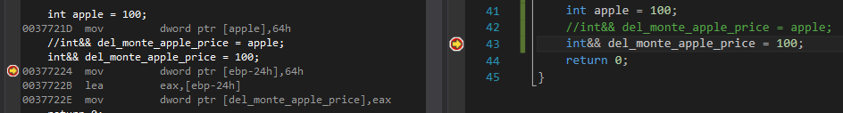

# Move Semantics (이동 의미론)

## 1. 복사 전달과 참조 전달
C를 계승한 C++역시 C와 마찬가지로 데이터를 어떤 함수로 넘길 때나 함수에서 반환할 때, 기본 동작을 (얕은) 복사로 정의하였다. 예를 들어 다음 함수 `append_smile`은 문자열을 취급하는 `std::string` 타입의 객체를 전달받아 같은 타입으로 리턴한다. 이 때, 이 함수가 문자열을 전달받을 때와 리턴할 때 모두 값을 복사하여 주고 받는다. 즉, 복사 전달을 수행한다.

```C++
#include <string>
#include <vector>

std::string append_smile(std::string str)
{
    return str + " :)";
}

void foo()
{
    std::vector<std::string> good_sentence;

    good_sentence.push_back("Hi");
    good_sentence.push_back("Nice meet you");
    good_sentence.push_back("Beautiful!!");
    good_sentence.push_back("Wonderful!!");

    // C++ 11부터 auto로 대체 가능
    // for(auto it = good_sentence.begin(); it != good_sentence.end(); it++)
    /*
    2. C++ 11부터 lambda expression으로 대체 가능 (여기서는 for_each 함수 사용)
    std::for_each(good_sentence.begin(), good_sentence.end(), [](std::string& str) {
        str = append_smile(str);
    });
    */
    for(std::vector<std::string>::iterator it = good_sentence.begin(); it != good_sentence.end(); it++)
        *it = append_smile(*it);
}
```

복사 전달은 데이터를 그대로 복사하여 넘기기 때문에 클래스 내부에 기본 형식의 포인터(* 연산자로 선언한 포인터 변수)가 멤버 변수로 존재한다면 메모리 복사에 신경 써야 한다. 왜냐하면 C++의 기본 동작은 복사 중에서도 얕은 복사(단순히 값을 배정하는 방식)이기 때문이다. 따라서 C++는 복사 생성자(copy constructor 또는 copy ctor.)와 복사 배정 연산자(copy assignment operator)에 대한 오버로딩을 제공함으로써 적절히(논리적으로) 옳은 복사를 할 수 있도록 도와준다.

또 다른 문제점은 데이터를 복사하여 넘길 때 성능적 이슈가 발생할 수 있다는 것이다. 특히 많은 멤버 변수를 가지고 있거나 복사해야 할 내용이 많은 멤버 변수를 가지고 있는 클래스의 경우 성능 하락이 두드러진다. 굳이 복사해서 넘길 필요가 없는 경우에도 복사를 하는 것은 상당히 비효율적이라서 C에서는 포인터를 사용하여 이를 해결하기도 한다.

```C++
// 생략...
std::string append_smile(const std::string* const str)
{
    return (*str) + " :)";
}
// 생략...
void foo()
{
    // 생략...
    for(std::vector<std::string>::iterator it = good_sentence.begin(); it != good_sentence.end(); it++)
        *it = append_smile(&(*it));
    // 생략...
}
```

하지만 C++는 C에서 한 단계 더 진화하여 포인터를 사용하지 않아도 복사 전달을 하지 않는 방법이 존재하는데, 바로 참조(reference) 변수를 이용한 방법이다. 참조 변수란 변수에 별칭을 붙이는 개념으로, 변수 선언 시 타입 뒤에 `&`를 붙여 표현한다. 한 번 별칭을 붙였으면 그 뒤로 변경할 수가 없어서 다음 코드에서 `price`은 참조 선언된 이후 `banana`가 아니라 `apple`이다.

```C++
int apple = 10, banana = 30;
int& price = apple; // 이제부터 price는 apple의 별칭. 이후로는 마치 일반 변수 쓰듯이 쓸 수 있다.

price = price * 2;  // price = apple = 20, banana = 30
price = banana;     // price = apple = 30, banana = 30
```

변수 `price`는 `apple`을 배정받았기 때문에 이 둘은 일심동체가 된다. 즉, 이후 코드에서는 `int`형 변수처럼 쓰일 수 있고, 특히 `apple`과 동일한 값이다. 바로 위 코드에서 `price = banana;`라고 했을 때는 `price`가 `apple`에서 `banana`로 별칭을 갈아탄 것이 아니라, `price`와 한 몸인 `apple`의 값을 `30`으로 바꾸는 것이다.

참조 변수를 통해 값을 전달하는 방식인 참조 전달을 첫 번째 예제에 적용하면 다음과 같다.

```C++
// 생략...
std::string append_smile(const std::string& str) // 참조 전달. 값의 변경은 없어서 const로 선언함.
{
    return str + " :)";
}
// 생략...
void foo()
{
    // 생략...
    for(std::vector<std::string>::iterator it = good_sentence.begin(); it != good_sentence.end(); it++)
        *it = append_smile(*it);
    // 생략...
}
```

이렇게 정의하면 `append_smile`에서 문자열을 전달할 때 이전 방법에 비해 비용이 줄어들 것이다.

## 2. 왼값(lvalue)와 오른값(rvalue)
왼값(lavlue)은 배정 연산에서 왼쪽에 올 수 있는 값으로서, 일반적인 변수가 여기에 해당한다. 반면 오른값(rvalue)는 왼값과 달리 왼쪽에 올 수 없는 값이다. 언뜻 보면 무슨 차이인지조차 모르겠지만, 이 둘의 결정적인 차이는 메모리를 할당받아 그 주소를 가지고 있는지의 여부이다. 만일 메모리 공간을 할당받고 그 주소를 가지고 있어서 접근 가능하면 왼값이고, 그렇지 않으면 오른값이다. 따라서 변수(variable)는 왼값이지만 리터럴(literal)이나 임시 객체의 경우 별도의 메모리를 차지하지 않거나 (마치 일반 변수처럼) 주소를 갖고 접근할 수 없기 때문에 오른값이다.

## 3. 왼값 참조(lvalue reference)와 오른값 참조(rvalue reference)
C++ 11에서 이동 의미론(move semantics)이라는 개념이 도입되면서 참조 유형을 둘로 분화했는데, 하나가 왼값을 참조할 수 있는 왼값 참조(lvalue reference)이고 다른 하나가 오른값을 참조할 수 있는 오른값 참조(rvalue reference)이다. 왼값 참조의 경우 기존의 참조 형식과 일치하게 `&`로 표현하며, 왼값 참조가 참조할 수 있는 값은 왼값 뿐이다. 반면, 오른값 참조의 경우 새로 도입된 개념인 만큼 `&&`로 표현하며, 오른값 참조가 참조할 수 있는 값은 오른값 뿐이다. (엄밀히 말하자면, 확실히 오른값 뿐이라고는 말 못하는데, 참조하는 타입 자체가 참조 형식인 경우가 그렇다. 관련 내용은 후술한다.)

```C++
int orange = 100;
int& orange_price = orange; // lvalue reference. 기존의 참조 형식과 일치.
int&& apple_price = 200;    // rvalue reference.

int apple = 200;
int& del_monte_orange_price = 1000; // 컴파일 에러.
int&& del_monte_apple_price = apple; // 컴파일 에러.
```

이 때, 오른값이야 수식의 결과나 임시 객체처럼 어차피 잠시 스쳐지나가는 값이다 보니 직관적으로 왼값 참조에 배정될 수 없다고 이해할 수 있다. 하지만 왼값의 경우 분명히 해당 타입(위 예제에서는 `int`)의 값을 가지고 있는 값이고, 거기에 더해 주소까지 취할 수 있기 때문에 경우에 따라서는 오른값으로 여길 수도 있다. (어차피 값을 가지고 있는 것은 동일하니까.) 따라서 위의 컴파일 에러에서 두 번째는 다소 불합리할 수 있다. 이에 C++는 왼값의 경우 오른값으로 형 변환을 수행할 수 있도록 허용한다. 즉, 위 델몬트 사과 가격을 다음과 같이 배정한다면 문제가 없다.

```C++
int&& del_monte_apple_price = static_cast<int&&>(apple); // 또는 (int&&)apple;
```

추가로, 위에서는 타입에 `&&`를 붙일 때의 타입은 참조 타입이 아닌 것으로 간주한다. 즉, 타입에 `&&`를 붙였는데 마침 타입이 참조 타입(`&`가 붙은 타입)이라면 이는 왼값 참조로 본다. `&&`를 붙여 오른값 참조가 되는 경우에는 참조(`&`)가 붙지 않은 타입에 한정한다. 물론, 이런 경우가 어디있겠나 싶을 수도 있다. 왜냐하면 일반적으로 참조 타입에 `&&`를 붙이면 컴파일 시간에 오류가 발생하기 때문이다.

```C++
int& && value = 100; // 컴파일 에러
```

하지만, 다음과 같이 구성한다면 컴파일 시간에 오류가 발생하지 않는다.

```C++
template <typename T>
struct append_rvalue_reference { typedef T&& type; };

int main()
{
    int apple = 100;
    append_rvalue_reference<int&>::type price = apple; // OK
    append_rvalue_reference<int&>::type price2 = 100; // error
}
```

위 예제에서 `price`는 `int&` 타입에서 오른값 참조 연산자 `&&`를 붙인 타입으로 선언된 변수이다. 즉, 표현상으로는 `int& &&` 타입인 것이다. 하지만 이런 표현은 C++에서 허용하지 않기 때문에 `int&` 타입으로 간주하는 것이다. 즉 `price`는 왼값 참조인 것이다. `price`와 동일한 타입으로 선언된 `price2`가 왼값 참조임을 여실히 보여주는데, 오른값 `100`을 대입하자 Visual Studio에서는 다음과 같은 오류를 출력했다.

```
Initial value of reference to non-const must be an lvalue
(비상수 (왼값)참조의 초기 값은 왼값이어야 한다.)
```

의미가 완전히 대응하지는 않지만 어쨌든 오른값을 왼값 참조에 넣으려고 했기 때문에 오류가 발생했다. 참고로, 오류의 원래 의미를 살려 해결하기 위해서는 다음과 같이 고치면 된다.

```C++
append_rvalue_reference<const int&>::type price2 = 100; // OK
```

## 4. 오른값 참조 변수는 오른값일까, 아니면 왼값일까?
왼값과 오른값의 차이는 그렇다 치더라도, 오른값을 참조할 수 있는 참조변수는 과연 왼값일까? 오른값일까? 일단 오른값이라고 주장하는 사람들은 "오른값"이 들어갔기 때문이라고 (단순히) 생각했을 확률이 높다. 본인도 처음 왼값과 오른값에 대한 개념이 정립되지 않았을 때는 헷갈렸는데, 정답은 오른값 참조 변수 역시 왼값이다. 왜냐하면 오른값 참조 변수에 오른값을 대입한 후 마치 변수 사용하듯이 사용할 수 있기 때문이다. 심지어 오른값 참조 변수에 주소도 취할 수 있는데, 가령 Visual Studio에서 오른값 참조 변수를 어떻게 취급하는지 디버깅 창으로 확인할 수 있다.



오른값 참조 변수를 선언한 부분에 중단점(breakpoint)을 걸어놓고 디버깅 후 어셈블리 창을 띄웠다. 10진수 100은 16진수로 64h이고, 이 값을 `del_monte_apple_price`에 배정하는 것을 VS는 `mov` 명령어를 사용하였다. `mov` 명령어의 첫 피연산자(operand)는 값을 옮길 대상(목적지) 메모리 공간인데, 여기서 `[ebp-24h]`로 정했다. (부가적으로 4바이트를 옮겨야 하기 때문에 `dword ptr`로 지시했다.) 그런데 어셈블리에서 `[x]`는 숫자 값 `x`로 나타나는 메모리 공간을 의미하기 때문에 `del_monte_apple_price`라는 오른값 참조 변수는 사실 메모리 공간을 차지하는 변수라고 할 수 있다. 결국, `del_monte_apple_price`는 왼값이라는 것을 알 수 있다.

추가로, `del_monte_apple_price`는 왼값이기 때문에 다음과 같이 포인터로 취할 수도 있다.

```C++
int* p_del_monte_apple_price = &del_monte_apple_price; // OK
```

## 5. `std::move` 함수
`std::move`함수는 임의 타입의 왼값 혹은 오른값을 받아 오른값으로 형 변환 해주는 함수이다. 간단히 생각하면 다음과 같이 볼 수도 있다.

```C++
namespace std
{
    template <typename T>
    T&& move(T&& obj)
    {
        return (T&&)obj;
    }
}
```

왼값 혹은 오른값을 받기 위해 rvalue 참조 연산자인 `&&`를 붙여서 파라미터를 받아 형 변환 후 다시 리턴하는 간단한 함수이다. 이 때, 오른값이야 의도한대로 동작하겠지만 왼값을 파라미터로 받으면

```C++
int value = 10;
move(value);
```

다음과 같이 적용된다.

```C++
int& move<int&>(int& obj)
{
    return (int& &&)obj; // return (int&)obj;
}
```

왼값 참조에 대한 오른값 참조 연산자는 왼값 참조임을 3절에서 확인했다. 따라서, 의도와 달리 왼값을 리턴하는 꼴이기 때문에 오른값을 리턴하도록 보장하기 위해서는 타입에서 참조 연산자 `&`를 제거해야 한다. 여러가지 방법이 있겠지만, C++ 표준에서 이를 제공하고 있다.

```C++
template <typename T>
typename std::remove_reference<T>::type&& move(T&& obj)
{
    return static_cast<typename std::remove_reference<T>::type&&>(obj);
}
```

`std::remove_reference` 템플릿을 사용하면 정확히 타입 `T`에서 참조 연산자를 제거할 수 있다.

## 6. `const`한정자와 오른값 참조
왼값 참조와 오른값 참조에 `const` 한정자를 붙이면 네 가지 조합이 나오는데, 다음과 같다.

```C++
void foo(std::string&);             // #1
void foo(const std::string&);       // #2
void foo(std::string&&);            // #3
void foo(const std::string&&);      // #4
```

그리고 위 조합에 대해 호출될 수 있는 경우를 따지면 다음과 같다.

```C++
std::string name("mitsuha");
const std::string taki("mitsuha");

const std::string yourname() { return "taki"; }

foo(name);          // #1, #2
foo(taki);          // #2
foo(std::string()); // #3, #4, #2
foo(yourname());    // #4, #2
```

 * `foo(name)` : `name`은 `std::string` 타입의 변수이므로 왼값이다. 그리고 `const` 한정자로 선언되어 있지도 않기 때문에 1번 함수가 우선적으로 호출된다. 만일 1번 함수가 존재하지 않는다면 2번이 차선으로 선택된다. C++에서는 (표준과 달리 표현이 모호하지만) 자연스러운 방향의 자동 형 변환이 이루어지는데, `const` 한정자가 없는 값에서 한정자를 붙이는 방향은 (소위) '자연스러운' 방향이라서 2번이 선택될 수 있다. 2번 함수까지 없으면 컴파일 에러이다. 3번과 4번 함수는 오른값 참조를 받기 때문에 선택될 수 없다.
 * `foo(taki)` : `taki`는 `std::string` 타입의 변수이고 `const` 한정자까지 더해진 왼값이다. 그렇다면 `const` 한정자가 붙은 왼값 참조를 프로토타입으로 갖는 2번 함수가 호출된다. 만일 2번 함수가 없으면 컴파일 에러인데, (3번과 4번 함수는 상기했듯이 오른값 참조를 받기 때문이고) `const` 한정자가 붙은 값에서 `const` 속성을 떼어내는 것은 상기한 '자연스러움'과 상반되기 때문에 1번 함수를 차선으로 호출할 수 없다. 즉, 부자연스러운 방향의 형 변환이기 때문에 명시적으로 형 변환을 해야한다. (이 때 사용되는 형 변환 연산자가 `const_cast`이다.)
 * `foo(std::string())` : `std::string` 클래스에 대한 임시객체를 함수에 바로 넘긴 경우이다. 임시객체는 오른값을 인수로 받는 3번과 4번이 우선 호출된다. 이 때, 임시객체의 타입은 명시적으로 `const` 한정자가 붙지 않으므로 3번이 1순위로, 4번이 2순위로 호출된다. 만일 3번과 4번 함수가 존재하지 않으면 2번 함수가 호출된다.
 * `foo(yourname)` : 위 경우와 마찬가지로 함수의 리턴 값 역시 오른값이나, 명시적으로 `const` 한정자가 붙었으므로 위와 다르게 4번 함수가 먼저 호출된다. 이미 붙어있는 `const` 한정자를 일부러 뜯어내지 않는 이상 3번 함수가 호출되지는 않는다. (위에서 설명한 '자연스러움'에 어긋나기 때문이다.) 4번 함수가 존재하지 않으면 2번 함수가 차선책으로 선택된다.

### 6.1. `const T&&`의 논리적 모순
왼값 참조와 오른값 참조에 `const`를 조합하다 보니 `const T&&`꼴의 조합이 나오긴 했는데, 과연 이 표현이 합당한지에 대해서 재미있는 문서를 하나 발견했다.

[What are const rvalue references good for?](https://www.codesynthesis.com/~boris/blog/2012/07/24/const-rvalue-references/) written by Boris Kolpackov

이 문서에서 자세히 설명하고 있는 내용을 정리하면, `T&&`꼴은 거의 대부분 객체를 '이동'시키기 위함이고 '이동'된 객체는 모두 호출자가 처리하는 문제이다. 그런데 엄연히 이동한 객체에 쓸때없이 상수성을 붙여 리턴할 필요가 있을까 한다는 것이다. 즉, 호출자가 그 내용을 받아 구워먹던 삶아먹던 알아서 할 것을 미리 제한한다는 것이다. 그리고 왜 변하지도 않는(immutable) 객체를 옮기려고 애를 쓰는지 묻고 있다.

이 글의 글쓴이는 `const T&&` (오른값 상수 참조, const rvalue reference)에 대해서 오른값 전달을 완전히 막는 방어적(bullet-proof) 수단으로밖에 사용되지 않는다고 한다. 대표적으로 `std::reference_wrapper` 클래스 템플릿과 함수 `std::ref`와 `std::cref`에서 그 예를 찾아볼 수 있다. `std::reference_wrapper`는 왼값에 대한 참조를 가지고 있음을 의미하는데, 이 때문에 클래스 템플릿(의 구체화)을 리턴하는 함수인 `std::ref`와 `std::cref`는 오른값에 대해 취급하지 않는다. 이 때, 상수성을 지닌 오른값에 대해서도 이 규칙을 만족시키기 위해 표준에서는 두 함수에 대해 다음과 같이 정의하였다.

```C++
template <class T> void ref (const T&&) = delete;
template <class T> void cref (const T&&) = delete;
```

## 7. 전달 참조(forwarding reference)와 오른값 참조
타입 바로 뒤에 `&&`를 쓴다고 반드시 오른값인 것은 아니다. 이 사실에 대해 3번 항목에서 언급했듯이, 참조 타입이 오른값 참조에 대한 타입으로 들어오면 (다시말해 (비표준 표현으로) `T& &&`따위가 되면) 참조 변수는 왼값(`T&`)을 나타낸다는 것이다. 단, 예제에서도 보였듯이 타입 `T`가 구체적인 타입이 될 수 없고 템플릿 타입이나 `auto`여야 한다는 것이다.

```C++
int apple = 100;
int& && price = apple; // error

template <typename T>
struct rvalue_ref
{
    typedef T&& type;
};

rvalue_ref<int&>::type price2 = apple; // OK
auto&& price3 = apple; // OK
```

위 코드에서 `int& &&`꼴은 허용하지 않고 에러가 발생하지만 형식 연역(type inference)을 통해 결국 같은 의미가 될 `rvalue_ref`와 `auto`는 허용이 된다. 그리고 이 때 연역되는 결과는 `int&`이다. 이처럼 형식 연역 결과 왼값도 될 수 있고 오른값도 될 수 있는 참조를 전달 참조(forwarding reference) 또는 보편 참조(universal reference)라고 한다. 용어에 있어 전자가 많이 언급되고 무엇보다도 C++의 아버지가 그렇게 부르자고 제안했으니 우선 배치했다. 하지만 역시 C++의 권위자 중 한 명인 스콧 마이어스(Scott Meyers)는 이곳저곳에 모두 형식 연역이 이루어질 수 있다는 점을 강조하기 위해서인지 'forwarding'이 아니라 'universal'이라고 부르고 있다.

사실 Meyers의 말도 일리가 있는 것이, 전달 참조(혹은 보편 참조)는 왼값과 오른값에 모두 바인딩 할 수 있을 뿐만 아니라 cv 한정자(cv-qualifiers, cv는 const와 volatile)에 상관 없이 바인딩 할 수 있다.

한편, 구체적인 타입이 명시가 된 상태에서 `&&`가 붙은 경우(`int&&`나 `std::string&&`같은 경우)에는 무조건 오른값임이 보장된다.

```C++
rvalue_ref<int>::type value1 = 10;              // OK
rvalue_ref<int&>::type value2 = value1;         // OK
rvalue_ref<const int>::type value3 = 30;        // OK
rvalue_ref<const int&>::type value4 = value2;   // OK

int&& value5 = 10;      // OK
int&& value6 = value1;  // error
int&& value7 = value2;  // error
```

위 코드에서 `value6`과 `value7`을 제외한 나머지는 모두 옳은 표현이다. `value6`과 `value7`은 모두 왼값을 나타내는 변수를 배정(assignment)했으므로 오류가 발생한다. (오른값 참조 변수 자체는 '왼값'이다!!)

## 8. `std::forward` 함수
인수로 전달받아 무조건 오른값으로 형 변환하는 `std::move`함수와 달리 `std::forward`함수는 전달받은 타입에 따라 값을 오른값으로 바꿀 수도 있고 왼값으로 바꿀 수도 있다. 가령, 다음과 같은 코드에서

```C++
int value = 0;

std::forward<int>(value) = 10;  // error
std::forward<int&>(value) = 30; // OK
```

첫 번째 `std::forward` 호출은 그 리턴 값이 오른값이므로 오류지만 두 번째 호출에서는 왼값을 리턴하므로 오류가 발생하지 않는다.

이런 함수가 필요한 까닭은 7번 항목에서 보였다시피 템플릿에서 사용하는 타입과 `auto`변수처럼 경우에 따라 왼값과 오른값을 모두 참조할 수 있을 때 필요하기 때문이다. 예를들어, 다음과 같은 클래스에서는 `std::forward` 함수가 필요하다.

```C++
class YourName
{
public :
    template <typename T>
    void setName(T&& name) { this.name = std::forward<T>(name); }
private :
    std::string name;
};
```

`setName`의 인수 `name`이 왼값인지 오른값인지 모르기 때문에 경우에 따라 호출할 생성자나 배정연산자가 달라질 수 있다. (왼값이면 복사, 오른값이면 이동.) 따라서 무조건 이동연산을 수행하는 것은 위험할 수 있는지라(왜냐하면 호출자가 나중에라도 전달한 `name`을 사용할 수 있기 때문에) `std::move` 함수보다는 `std::forward` 함수가 더 안전하다.

한편, 오른값이 보장되어 있는 경우에는 `std::move` 함수가 더 이득인데, 왜냐하면 오른값임이 확실하면 조건 안따지고 무조건 이동해야 하기 때문이다. 위 클래스를 조금만 수정하면 다음과 같다.

```C++
class YourName
{
public :
    void setName(std::string&& name) { this.name = std::move(name); }
private :
    std::string name;
};
```

정리하자면, 전달 참조에는 `std::forward` 함수를 사용하고, 오른값 참조가 보장되는 경우에는 `std::move` 함수를 사용해야 한다.

## 9. 참고
 * Scott Meyers, Effective Modern C++, 류광 옮김 (인사이트, 2015), pp.169-197.
 * Why adding `const` makes the universal reference as rvalue, stackoverflow, last modified May 23, 2017, accessed May 23, 2018, https://stackoverflow.com/questions/38814939/why-adding-const-makes-the-universal-reference-as-rvalue.
 * What are const rvalue references good for?, Code Synthesis, last modified July 24, 2012, accessed May 23, 2018, https://www.codesynthesis.com/~boris/blog/2012/07/24/const-rvalue-references/.
 * Rule of three, Wikipedia, Dec 19, 2017, https://en.wikipedia.org/wiki/Rule_of_three_(C%2B%2B_programming)
