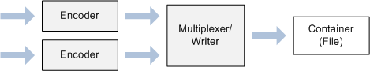

# 미디어 파운데이션 : 필수 개념

## 스트림 (Streams)

*스트림*은 정해진 형식으로 이루어진 일련의 미디어 데이터이다. 가장 흔한 형식으로는 오디오와 비디오가 있지만, 스트림은 임의의 종류의 데이터 (가령, 텍스트나 스크립트 명령이나 이미지)를 담을 수 있다. 이 문서에서 말하는 *스트림*은 네트워크를 타고 전달하는 것을 말하는건 아니다. 로컬에서 재생하는 미디어 파일 역시 스트림을 가지고 있다.

보통 미디어 파일은 하나의 오디오 스트림을 가지고 있거나, 오디오 스트림과 비디오 스트림을 각각 딱 하나씩 가지고 있다. 하지만 반드시 그러라는 법은 없고 같은 종류의 여러 스트림을 가지고 있을 수도 있다. 가령, 어떤 비디오 파일은 다국어 지원을 위해 여러 개의 오디오 스트림을 가질 수 있다. 이런 경우, 미디어 파일을 재생할 때 애플리케이션은 재생하려는 스트림을 하나 정할 수 있다.

## 압축 (Compression)

*압축*은 중복된 정보를 제거함으로써 데이터 스트림의 크기를 줄이는 작업을 말한다. 압축 알고리즘은 크게 두 가지로 분류할수 있다.

 * *무손실* 압축 : 데이터를 손실하지 않으면서 압축하는 알고리즘을 사용하여 압축된 데이터를 다시 복원시켰을 때의 데이터는 원본과 동일하다.
 * *손실* 압축 : 데이터를 일부 손실하면서 압축하는 알고리즘을 사용하여 압축된 데이터를 다시 복원시켰을 때의 데이터는 원본과 **비슷하다**. 다시말해, 원본 데이터와 동일하지 않다.

대부분 다른 영역에서의 데이터는 손실 압축할 수 없다. (가령, 스프레드 시트를 손실 압축한 다음 복원시켰을 때 스프레드 시트 내부의 데이터를 "적절히" 돌려놓는다고 생각해보자. "정확히"가 아니다.) 하지만 손실 압축 기법이 오디오와 비디오에서는 꽤나 잘 어울리는데, 그 이유는 다음과 같다.

 1. 사람의 물리적인 지각 능력에 한계가 있다는 점이다. 녹음된 음악과 같이 여러 복합된 소리를 들을 때, 포함된 일부 소리는 귀로 지각하기 힘들다. 신호 처리 이론에 따르면, 지각할 수 없는 여러 주파수를 분석하고 분리할 수 있는데, 지각적인 영향을 끼치지 않으면서 이런 주파수 정보를 제거할 수 있다. 비록 압축 후 다시 복원시켰을 때의 데이터는 원본과 일치하지는 않겠지만 청취자로 하여금 원본과 동일한 *소리를 들려줄 수 있을 것이다*.

 2. 의도하는 목적에 따라서는 소리나 사진의 품질이 저하되더라도 괜찮을 수 있는데, 가령 전화기에서 오디오는 흔히 높은 비율로 압축될 수 있다. 압축된 소리로 전화 통화를 하는 데 별 지장 없이 충분하기 때문이다. 하지만 수화기 너머 교향곡 오케스트라를 듣고 싶지는 않을 것이다. (오케스트라 음악을 듣기에는 품질이 매우 저질이다.)

압축은 또한 *인코딩(encoding)* 이라고 하고, 인코드를 담당하는 장비를 *인코더(encoder)* 라고 한다. 한편, 압축의 반대 처리를 *디코딩(decoding)* 이라고 하고, 자연스레 디코드를 담당하는 장비를 *디코더(decoder)* 라고 한다. 인코더와 디코더를 모두 포함한 일반적인 용어를 *코덱(codec)* 이라고 한다. 하드웨어 또는 소프트웨어로 코덱을 구현할 수 있다.

압축 기술은 디지털 미디어 시대가 도래한 이래로 급격히 변화하고 있다. 그리고 오늘날 수많은 압축 기법을 사용하고 있다. 이러한 사실은 디지털 미디어를 다루는 프로그래밍을 할 때에 마주치는 주요 도전 중 하나이다.

## 미디어 컨테이너 (Media Containers)

오디오나 비디오 스트림을 파일로 저장할 때 가공하지 않은 날 것(raw)의 상태로 저장하기는 드물다. 그리고 네트워크를 통해 직접 오디오나 비디오 스트림을 전송하는 것도 흔치 않다. 이러한 데는 여러 이유가 있겠지만, 사용하려는 코덱이 무엇인지 미리 알지 못하고서는 스트림을 디코딩 할 수 없기 때문이다. 따라서 미디어 파일은 적어도 다음 항목 중 일부를 포함하곤 한다.

 * 스트림 개수, 각 스트림의 방식 등을 나타내는 파일 헤더
 * 특정 내용으로 임의 접근이 가능한 인덱스
 * 내용을 나타내는 메타데이터 (가령, 아티스트나 제목)
 * 네트워크 전송이나 임의 접근이 가능한 포캣 헤더

여기에서는 *컨테이너*라는 용어는 스트림, 헤더, 인덱스, 메타데이터 등 전체를 하나로 묶은 패키지를 의미한다. *파일*이라는 용어 대신에 *컨테이너*를 사용한 이유는 일부 컨테이너는 파일이 아닌 라이브 방송을 위해 설계하기 때문이다. 애플리케이션 파일에 저장하지 않고도 실시간으로 컨테이너를 만들 수 있다.

일찍이 미디어 컨테이너의 예제는 AVI 파일 포맷이다. 다른 예로는 MP4나 Advanced Systems Format (ASF)가 있다. 컨테이너는 파일 이름 확장자 (가령 .mp4)나 MIME 형식으로 구별할 수 있다.

아래 보이는 그림은 미디어 컨테이너에 대한 일반적인 구조를 보여주고 있다. 이 그림은 특정 미디어 형식을 나타내는 것이 아니다. 각각의 미디어 형식의 상세는 매우 다양하다.

그림에서 보여주는 구조는 컨테이너의 시작 부분에 헤더 정보가 나타나면서 계층적인 구조를 보여주고 있다. 이 구조는 많은(하지만 전부는 아닌) 컨테이너 방식의 일반적인 형태이다. 그리고 데이터 섹션에서 오디오와 비디오 패킷이 번갈아 가면서 위치하게 된다. (이를 인터리빙(interleaving)이라고 한다.) 이런 종류의 인터리빙은 미디어 컨테이너에서 흔히 볼 수 있다.

*멀티플렉싱(multiplexing)* 이라는 용어는 오디오와 비디오 스트림을 패킷화 하는 처리를 말하는데, 여기서 컨테이너에 (오디오와 비디오 스트림의) 패킷을 인터리빙하는 과정이 포함되어 있다. 이 반대 처리는 패킷화된 데이터로부터 스트림을 재조립 하는 과정으로서, *디멀티플렉싱(demultiplexing)* 이라고 부르기도 한다.

## 서식 (Formats)

디지털 미디어에서 *서식*이라는 용어는 애매하다. 서식은 H.264 비디오와 같이 *인코딩* 종류일 수도 있고 MP4와 같이 *컨테이너*일 수도 있다. 이런 차이는 일반 유저에게 자주 혼란스럽게 한다. 미디어의 이름을 미디어 서식으로 제공할 경우 항상 도움이 되는 것은 아닌 것이, 가령 *MP3*의 경우 인코딩 서식(MPEG-1 Audio Layer 3)과 파일 서식 둘 다 가리키기 때문이다.

하지만 이런 차이는 중요한데, 왜냐하면 미디어 파일을 실제로 읽을 때는 다음 두 단계를 거치기 때문이다.

 1. 컨테이너를 반드시 분석해야 한다. 대부분의 경우 스트림의 개수와 각 스트림의 서식은 이 과정이 완료되기 전에는 알 수 없다.
 2. 만일 스트림을 압축했으면 반드시 적절한 디코더를 사용하여 디코딩 과정을 거쳐야 한다.

이러한 사실은 각각의 구성 요소(디코더(decoder)나 분석기(parser))가 어느 부분에서 컨테이너를 분석하고 스트림을 디코딩 하는지 결정하며, 이는 곧 소프트웨어 디자인을 꽤나 자연스럽게 결정하는 셈이다. 게다가 이런 접근은 러그인(plug-in) 모델로 사용하기 좋아서 서드 파티가 자신의 분석기와 코덱을 제공할 수 있다. Windows에서는 컴포넌트 오브젝트 모델(Component Object Model, COM)이 구성 요소의 구현으로부터 API를 분리시키기 위한 표준 방법을 제공하는데, 이런 방법은 어떤 플러그인 모델이 지켜야 하는 규칙이다. 따라서, 미디어 파운데이션은 COM 인터페이스를 사용한다.

다음 그림은 미디어 파일을 읽는 데 사용되는 구성 요소를 보여준다.

미디어 파일을 기록할 때도 읽을 때와 마찬가지로 두 단계를 거친다.

 1. 압축되어있지 않은 오디오/비디오 데이터를 인코딩한다.
 2. 데이터를 압축한 뒤 특정 컨테이너 서식으로 기록한다.

다음 그림은 미디어 파일을 기록하는 데 사용되는 구성 요소를 보여준다.

## 관련 주제

[미디어 파운데이션 프로그래밍 가이드](https://docs.microsoft.com/en-us/windows/desktop/medfound/media-foundation-programming-guide)

## 원본

[Media Foundation: Essential Concepts](https://docs.microsoft.com/en-us/windows/desktop/medfound/media-foundation-programming--essential-concepts)