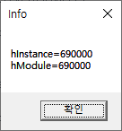
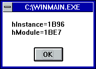

# Win32 유틸리티 함수 모음

## 시작하면서
윈도우 개발을 하다보면 자주 사용하는 함수가 있기 마련이다. 다행이도 API에서 제공해준다면 사용하면 그만이지만, 그렇지 않다면 직접 정의하면서 사용해야 한다.

특히, 유틸리티 함수들이 이런 경우가 많은 것 같다. 그리고 이런 부류의 함수들은 짧은 경험을 비추어 봤을 때, 함수 각각의 규모가 작은 탓에 필요할 때 마다 그때 그때 정의하여 사용한다. (물론 귀찮은 감도 없지않아 있어서 별도의 라이브러리 따위로 분리하여 관리하지도 않는 탓도 있다.)

문득 업무를 보는 도중 이런 함수들을 틈틈히 정리 해 놓으면 좋겠다는 생각에 오랜만에 블로그 포스트를 작성해본다.

## 목록
다음은 정리 해 놓은 유틸리티 함수 목록이다. 앞으로 추가될 가능성이 있으나, 본인의 능력을 고려했을 때 크게 기대하지 않는 편이 좋다.

 - SafeRelease
 - GetWndData / SetWndData
 - SetClientRect
 - ToUTF8 / ToUTF16
 - GetEXEInstance / GetDLLInstance

## SafeRelease
`SafeRelease`는 윈도우 프로그래밍 중에서도 COM과 관련한다면 자주 나오는 함수이다. COM에서 인터페이스는 익히 알다시피 참조 카운팅 기반이며, 인터페이스의 가장 조상님이라 할 수 있는 `IUnknown` 인터페이스가 참조 카운팅과 관련된 함수들을 순수 가상 함수로 선언하고 있다.

COM 인터페이스가 가리키는 객체는 `new` 나 `delete` 와 같이 직접 객체를 생성하고 해제하는 것이 아닌, `QueryInterface`와 같은 함수로 질의하여 얻어내야 한다. 질의 함수는 내부적으로 알맞은 객체를 생성한 뒤 `AddRef` 함수를 호출하여 참조 계수를 1 증가하고, 전달받은 인터페이스 포인터를 조작하여 객체를 가리킬 수 있게끔 조작한다.

말 주변이 없어 그런지 설명이 조금 어려운데, 코드로 보면 어렵지 않을 것이다.

```C++
HRESULT hr = E_FAIL;
IUnknown* pUnknown = nullptr;

// pUnknown 포인터를 조작해야 하므로 이중 포인터를 받는다.
// COM에서는 이런식으로 포인터를 리턴하지 않고 이중 포인터를 받음으로써 out 파라미터를 두고
// 리턴값은 HRESULT 타입의 결과 코드를 두는 편이다.
hr = pMyInterface->QueryInterface(IID_IUnknown, &pUnknown);
if (SUCCEEDED(hr))
{
    // 여기에서 pUnknown은 널 포인터가 아닌 어떤 객체를 가리키고 있음
    // pUnknown이 가리키는 객체는 내부적으로 참조 카운트가 1
    // 필요한 동작 블라블라...
}
```

윈도우 프로그래밍을 하다보면 이런 패턴의 코드는 흔히 볼 수 있겠다. 객체 생성을 `QueryInterface` 따위의 함수로 했는데, 이 함수는 상기한대로 내부적으로 객체를 잘 생성해서 `pUnknown` 포인터가 가리킬 수 있게끔 조작해준다. (함수 호출에 성공했다면.)

다만, 이 함수 내에서 객체를 어떻게 생성했는지는 짐작은 가능해도 정확히는 모르기 때문에 당연히 `delete` 연산자나 `free` 함수를 사용하여 메모리 해제를 시도해서는 안된다. (동적 할당이 유력하더라도.)

대신, `AddRef` 함수에 대응하는 `Release` 함수를 호출하여 참조 계수를 1 감소시키며, `Release` 함수는 내부적으로 참조 계수가 0이면 자기 자신을 파괴한다. 즉, 단순히 표현하자면 `delete this` 따위의 코드가 들어있다. (진짜다.)

따라서, COM 인터페이스를 모두 사용한 다음에는 이런 코드가 대부분 작성 되어있다.

```C++
if (pUnknown != nullptr)
{
    pUnknown->Release();
    pUnknown = nullptr;
}
```

`SafeRelease` 함수는 사실 별 것 없고, 인터페이스의 `Release` 함수를 대신 호출해주고 인터페이스 포인터에 널 포인터를 대입 하는 함수이다.

```C++
template <typename T>
void SafeRelease(T** ppT)
{
    if(ppT != nullptr && (*ppT) != nullptr)
    {
        (*ppT)->Release();
        (*ppT) = nullptr;
    }
}
```

위에서 보인 `pUnknown->Release()` 코드와 구조적으로 동일하되, `SafeRelease` 함수는 인터페이스 포인터까지 `nullptr`로 리셋하기 때문에 조작을 위해 이중 포인터를 인수 타입에 취했다.

앗, 사실 `SafeRelease`는 함수가 아니라 함수 템플릿이다. 함수 템플릿이라고 말 할걸 깜빡하고 함수로 도배를 해 놓았는데 `SafeRelease` 정의를 보여줄 때 쯤 _함수 템플릿_ 이라고 쓰지 않은 걸 알아챘기 때문이다. 이제와서 바꾸자니 귀찮아서 그냥 함수라고 말했다.

여튼, `SafeRelease`는 이런식으로 정의하며, `if`문 내에 `ppT`를 검사할지, `*ppT`만 검사할지 정도만 차이가 있을 뿐 COM 인터페이스의 `Release` 함수를 호출하고 `*ppT`를 널 포인터로 채우는 기본 동작은 동일하다 할 수 있다. 그리고 몇몇 예제에서는 함수 템플릿이 아니라 특정 인터페이스를 지정해놓은 버전도 더러 있다. 죽었다 깨어나도 특정 인터페이스 외에는 사용하지 않겠노라면 나쁘지 않은 방법이겠다.

구글에서 `SafeRelease` 함수 템플릿이 어디 정의 되어있는지 묻는 글이 많다. 하지만 이 함수는 따로 제공하지 않고, 직접 정의해서 써야한다. 다른 사람도 아니고 MS가 그랬으니까 진리다.

 - [SafeRelease - Win32 apps, Microsoft Docs](https://docs.microsoft.com/en-us/windows/win32/medfound/saferelease)

여담이지만, MS 개발자들도 매 번 정의하기 귀찮은지 D3D, Media Foundation과 같은 COM 관련 예제를 보면 그냥 `Release` 함수를 호출하고 땡치는 경우도 흔히 볼 수 있다.

## GetWndData / SetWndData
윈도우를 C++ 객체로 다루기 위해 윈도우마다 객체 주소를 저장할 메모리 공간을 할당 받는 기믹은 익히 알려져 있다. 할당 받은 메모리 공간에 접근하여 객체 주소를 저장하거나 객체 주소를 불러와서 멤버 함수를 호출하는 코드는 윈도우 프로그래밍에서 흔히 볼 수 있는 패턴이다.

상기한 패턴에서는 `GetWindowLongPtr` 함수를 윈도우 메시지를 처리할 때 마다 호출하곤 하는데, 이게 메시지 개수가 많아질 때 마다 부르기 매우 귀찮아진다. 그래서 본인은 윈도우 핸들에 대해 객체 주소를 저장하고 불러오는 함수를 유틸리티 함수로 만들어 두는 편인데, 이 함수가 `Get(Set)WndData` 이다.

`SafeRelease` 함수와 마찬가지로 함수 자체는 아주 간단하다. 인라인 함수로 정의해도 좋겠다.

```C++
template <typename T>
T* GetWndData(HWND hWnd)
{
    return reinterpret_cast<T*>(GetWindowLongPtr(hWnd, 0));
}

template <typename T>
void SetWndData(HWND hWnd, T* pData)
{
    SetWindowLongPtr(hWnd, 0, reinterpret_cast<LONG_PTR>(pData));
}
```

`Get(Set)WindowLongPtr`의 두 번째 인수로 `GWLP_USERDATA`를 넣어도 좋다. 이건 각자 사정에 맞게 수정하면 좋을 듯.

여담으로, 무지 옛날 코드는 `Get(Set)WindowLong` 함수를 사용하는 경우도 있는데, 노파심에 말하자면 이 함수는 추천하지 않는다. 왜냐하면, `Get(Set)WindowLong` 함수는 함수 이름 그대로 `LONG` 타입의 인수를 취급하기 때문이다.

`LONG` 타입은 결국 `long` 타입을 타입 정의한 것에 불과하는데, 64비트 응용 프로그램에서도 `int`나 `long`은 32비트인 반면, 포인터 타입의 크기는 64비트로 확장되는 탓에 포인터 타입을 정수 타입으로 형 변환 할 때 `int`나 `long` 타입으로 변환하면 메모리 주소의 상위 32비트가 잘리는 문제가 발생한다.

하지만 오랫동안 `LONG` 타입을 32비트로 취급해왔기 때문에 이걸 64비트로 무작정 확장할 수도 없는 노릇이다. 대신, `LONG_PTR` 이라는 새로운 타입을 제공하여 64비트 환경에서 포인터→정수 타입 변환 시 주소가 잘리는 부작용을 막았다. 이는 `INT_PTR` 타입도 동일하다. PTR이라는 단어가 붙었다고 해서 이 자체로 포인터 타입이라고 오해하기 쉽지만, 이들은 모두 정수 타입이다.

따라서, 메모리 주소를 저장할 때 `Get(Set)WindowLong` 함수 대신 `Get(Set)WindowLongPtr` 함수를 사용해야 하며, MS에서도 이를 인식한 듯 레퍼런스에 64비트에 대응하기 위해 `Get(Set)WindowLongPtr` 함수를 사용하라고 안내하고 있다.

> If you are retrieving a pointer or a handle, this function has been superseded by the GetWindowLongPtr function. (Pointers and handles are 32 bits on 32-bit Windows and 64 bits on 64-bit Windows.) To write code that is compatible with both 32-bit and 64-bit versions of Windows, use GetWindowLongPtr. (by [Windows Dev Center, Microsoft](https://docs.microsoft.com/en-us/windows/win32/api/winuser/nf-winuser-getwindowlongw))

## SetClientRect
클라이언트 영역의 크기를 구하는 함수는 `GetClientRect`이 있다. 윈도우 핸들과 `RECT` 구조체 변수의 주소를 전달하면 클라이언트 영역의 크기를 `RECT` 구조체 변수에 담아 리턴한다.

마찬가지로, 클라이언트 영역의 크기를 조절하는 함수로 `SetClientRect`이 있을 것 같지만, 이런 함수는 없다. 한마디로 페이크인 셈인데, 당연히 있을 줄 았았다가 없다는 사실을 알고 매우 약이 올랐던 경험이 있다.

윈도우 크기를 조절하는 함수는 `MoveWindow`와 `SetWindowPos`가 있는데, 모두 윈도우 전체 크기를 조절하는 함수이다. 윈도우는 클라이언트 영역 외에 제목표시줄, 메뉴, 경계선 등의 자리를 차지하고 있기 때문에 클라이언트 영역을 원하는 크기로 조절하기 위해서는 별 수 없이 `MoveWindow` 또는 `SetWindowPos` 함수를 호출하되, 이들 크기를 모두 고려해야 한다.

_이 크기가 몇 픽셀이다!_ 하고 정해져 있다면 문제가 되지 않지만, 아쉽게도 그런 건 없다. 정할 수도 없는게 윈도우 버전별로 다르게 측정되기도 하며, 같은 윈도우 버전에서도 테마에 따라 다를 수도 있다.

하지만 방법이 없는 것은 아니다. `AdjustWindowRect(Ex)` 함수는 윈도우 스타일과 메뉴가 있는지 여부와 함께 원하는 클라이언트 영역의 크기를 전달하면 `MoveWindow` 또는 `SetWindowPos` 함수로 전달해야 할 크기를 리턴한다. Ex는 `WS_EX_`로 시작하는 윈도우 확장 스타일을 전달 받는지 여부이고, 당연히 윈도우 확장 스타일까지 전달받는 `AdjustWindowRectEx` 함수를 사용하는 편이 좋겠다.

```C++
BOOL SetClientRect(HWND hWnd, int width, int height)
{
    BOOL bResult = FALSE;

    DWORD dwStyle = static_cast<DWORD>(GetWindowLongPtr(hWnd, GWL_STYLE));
    DWORD dwExStyle = static_cast<DWORD>(GetWindowLongPtr(hWnd, GWL_EXSTYLE));
    BOOL bMenu = IsMenu(GetMenu(hWnd));

    RECT rect = {0, 0, width, height};
    bResult = AdjustWindowRectEx(&rect, dwStyle, bMenu, dwExStyle);

    if(bResult)
    {
        bResult = SetWindowPos(
            hWnd,
            NULL,
            0,
            0,
            rect.right - rect.left,
            rect.bottom - rect.top,
            SWP_NOZORDER | SWP_NOMOVE);
    }

    return bResult;
}
```

DPI까지 고려한 `AdjustWidowRectExForDPI` 라는 함수도 있다. 만일 모니터별 DPI 대응이 필요하다면 `AdjustWindowRectExForDPI` 사용을 생각해 볼 만 하지만, 본인은 그닥 쓰고 싶지 않다.

## ToUTF8 / ToUTF16
웹 뿐만 아니라 요즘 대부분의 IT기기는 유니코드에 대응하고 있다. 대응이라기 보다는 유니코드를 사실상 표준으로 사용하고 있다고 봐야할 것이다. 그리고 유니코드의 인코딩 방식으로 UTF-8을 따르고 있는 것도 대부분 인정할 것인데, 문제는 윈도우에서 지원하는 기본 유니코드 인코딩 방식은 UTF-16이라는 점이다. 왜 UTF-16을 선택했는지, 불가피한지 별 이유가 없었는지는 잘 모르기 때문에 차치해둔다.

윈도우와 웹 같은 다른 환경간의 유니코드 인코딩 방식 차이로, 상호 통신할 때 문자열이 껴있으면 UTF-8과 UTF-16을 변환하는 작업이 자주 (아주 자주) 일어난다.

다행이도, 직접 인코딩 방식을 캐치하여 다른 인코딩 방식으로 조립하는 과정이 필요 없이, 제공되는 Win32 함수를 사용하면 된다.

 - UTF-8 → UTF-16 변환 시 : `MultiByteToWideChar` 함수 호출
 - UTF-16 → UTF-8 변환 시 : `WidtCharToMultiByte` 함수 호출

함수 이름이 아주 정직하다. 와이드(Wide) 문자는 윈도우에서 `WCHAR`로 표기되는 문자를 의미하는 데, 이게 2바이트 크기이다. `short` 타입이라고 생각해도 좋고, C++의 `wchar_t`도 윈도우에서는 2바이트 크기이기 때문에 (적어도 윈도우 환경에서 만큼은) `WCHAR`와 `wchar_t`가 같다고 생각해도 큰 무리는 없다.

UTF-16은 2바이트 또는 4바이트로 한 글자를 표기하므로 와이드 문자라고 생각하면 되고, UTF-8은 적게는 1바이트에서 많게는 4바이트에 한 글자를 표기하기 때문에 멀티 바이트 문자라고 생각하면 된다. 그런데, 솔직히 말해서 UTF-16도 2바이트 고정으로 표기하는 인코딩 방식은 아니기에 멀티 바이트 문자에 해당하는 것 같다.

본인도 이에 동의하는 바이다. 사실, 예전 MSDN 문서를 찾아보면 UCS-2 방식을 사용한다는 대목이 있는데, 과거 윈도우 (NT 4.0 이런거..) 에서는 UCS-2를 지원했다고 한다. 여담으로, UCS-2는 2바이트 고정으로 유니코드 문자를 인코딩 하는 방식인데, 이 탓에 유니코드의 BMP(Basic Multilingual Plane) 영역에 존재하는 문자만 표기가 가능하다.

그러다가 UTF-16으로 지원 체계를 전환하면서 지금에 이르렀는데, UCS-2에서 이미 와이드 문자라는 용어가 생겨 멀티 바이트 인 것 같은데도 UTF-16으로 인코딩한 문자는 와이드 문자로 간주하는 것으로 보인다.

여튼, 상기한 두 함수를 적절히 사용하여 `ToUTF8(16)` 함수를 만들어두면 정말 유용하게 사용할 수 있다.

```C++
#include <string>
#include <vector>

std::wstring ToUTF16(const std::string& utf8)
{
    std::vector<wchar_t> utf16(1, L'\0');

    if(!utf8.empty())
    {
        int len = MultiByteToWideChar(
            CP_UTF8,
            0,
            utf8.c_str(),
            -1,
            nullptr,
            0);

        if(len > 0)
        {
            utf16.resize(len, L'\0');
            MultiByteToWideChar(
                CP_UTF8,
                0,
                utf8.c_str(),
                -1,
                utf16.data(),
                len);
        }
    }

    return {utf16.data()};
}

std::string ToUTF8(const std::wstring& utf16)
{
    std::vector<char> utf8(1, '\0');

    if(!utf16.empty())
    {
        int len = WideCharToMultiByte(
            CP_UTF8,
            0,
            utf16.c_str(),
            -1,
            nullptr,
            0,
            nullptr,
            nullptr);

        if(len > 0)
        {
            utf8.resize(len, '\0');
            WideCharToMultiByte(
                CP_UTF8,
                0,
                utf16.c_str(),
                -1,
                utf8.data(),
                len,
                nullptr,
                nullptr);
        }
    }

    return {utf8.data()};
}
```

필요한 버퍼 크기를 정확히 계산하기 위해 같은 함수를 두 번 호출했다. 그래서 함수가 큰 것 같지만, 사실 전달해야 할 인수가 많아 여러 줄에 걸쳐 써서 길어보이는 것 뿐이다. 이렇게 이쁘게 작성하면서 양을 불리면 코딩을 많이 한 것 같고, 코딩을 업으로 삼는 사람들은 덤으로 열심히 일한 것 같이 보이기 때문에 일석 이조라 할 수 있겠다.

그리고 Win32 자체에서 문자열을 다루기 위한 클래스 도구는 당연하지만 제공하지 않고 있다. `CStringW` 같은 클래스를 생각할 수 있지만, 이들은 모두 ATL에서 제공하는 클래스이므로 순수 Win32라고 보기에는 다소 무리가 있다. 그래서 별 수 없이 C++ STL의 `std::string`, `std::wstring`을 사용했다. 그리고 사용한 김에 버퍼도 `std::vector`를 사용했다.

## GetEXEInstance / GetDLLInstance
윈도우 프로그래밍을 하다 보면 `HINSTANCE` 핸들이 필요한 경우가 자주 있다. 가령, 윈도우를 생성하는 과정에서 사용하는 `WNDCLASS(EX)` 구조체나 `CreateWindow(Ex)` 함수에서도 이 핸들을 요구하기도 하고, 커서나 아이콘 등의 리소스를 로드할 때도 인스턴스 핸들을 전달하기도 한다.

EXE나 DLL에서 `HINSTANCE` 핸들을 얻을 수 있는 시점은 `WinMain`과 `DllMain` 엔트리 포인트 뿐이다. 두 엔트리 함수의 첫 번째 인수가 `HINSTANCE` 핸들이며, 필요할 경우를 대비하여 이 값을 보관하고 있기도 한다.

이렇게 `HINSTANCE` 핸들은 우리에게 꼭 필요한 값이라 `HINSTANCE` 핸들을 리턴해주는 함수가 있을 법 한데도 Win32에서는 이를 리턴해주는 직접적인 함수는 없다. 대신, `GetModuleHandle(Ex)` 함수를 사용하거나 링커에서 제공하는 `__ImageBase` 라는 식별자를 사용하여 `HINSTANCE` 핸들을 구할 수 있다.

```C++
extern "C" IMAGE_DOS_HEADER __ImageBase;

inline HINSTANCE GetEXEInstance()
{
    return reinterpret_cast<HINSTANCE>(GetModuleHandle(nullptr));
}

inline HINSTANCE GetDLLInstance()
{
    return reinterpret_cast<HINSTANCE>(&__ImageBase);
}
```

함수가 간단하여 인라인 함수로 정의했는데, 문제는 `GetModuleHandle` 함수의 리턴 타입인 `HMODULE`을 `HINSTANCE`로 _형 변환해서 써도 되는가_ 이다.

답은 **현재는 그렇다** 인데, 이를 설명하기 위해서는 Win16 (대략 윈도우 3.1)까지 히스토리가 올라간다. 본인도 이 때 당시의 윈도우 프로그래밍을 한건 아니라 자세한 내막은 잘 모르지만, 과거 Win16에서는 메모리 공간이 부족하여 EXE나 DLL이 메모리에 적재할 때 지금처럼 통째로 적재하지 않았다고 한다. 텍스트 섹션같이 고정된 영역과 데이터 영역같이 프로세스별로 메모리 값이 변경될 수 있는 영역을 분리하여 적재했고, 이 둘의 시작 주소를 각각 `HMODULE`과 `HINSTANCE`로 분리했다고 한다.

하지만 윈도우 95 이후로 프로세스 별로 메모리를 분리하기 시작했고, 각각의 프로세스는 4GB의 가상 메모리 공간에 필요한 EXE와 DLL을 통째로 적재할 수 있게 되었다. 그래서 고정된 영역과 그렇지 않은 영역을 분리할 필요가 없어지게 되고, 결국 `HMODULE`과 `HINSTANCE`는 같은 주소를 나타내는 핸들로 의미가 변했다.

백문이 불여일견이라고, 실제 `HMODULE`과 `HINSTANCE` 값이 같은지 다른지 확인해 보았다.



소스 코드를 윈도우 10에서 빌드하고 실행해보면 `hInstance`와 `hModule` 값이 동일함을 확인할 수 있다.




하지만 윈도우 3.1에서 빌드하고 실행해보면 두 값은 다름을 확인할 수 있고, 특히 이미 한 번 실행한 프로그램을 한번 더 실행했을 때, `hModule` 핸들은 값이 같은 반면, `hInstance` 핸들은 값이 달라지는 것도 확인할 수 있다. (여담으로, 윈도우 3.1에서 `GetModuleHandle` 함수에 `NULL`을 전달하면 함수가 실패하여 `NULL`을 리턴하는 것도 확인했다.)

하지만, 앞서 언급 했듯이 윈도우 95 이상에서는 `HINSTANCE`와 `HMODULE`이 사실상 같은 값을 가리키기 때문에 형 변환해서 사용해도 큰 무리는 없다.

그리고 `GetEXEInstance`와 `GetDLLInstance`로 나눈 이유는, `GetModuleHandle` 함수가 리턴하는 값은 무조건 EXE의 인스턴스 핸들이기 때문이다. EXE와 달리 DLL은 DLL 자신의 인스턴스 핸들과 자신을 로드한 EXE의 인스턴스 핸들 두 가지 경우에 대해 대응할 필요가 있어 보여 두 버전의 함수를 각각 만들었으며, `GetDLLInstance` 함수는 빌드 시 링커가 제공하는 `__ImageBase` 라는 외부 변수의 주소값을 취했다.

DLL에서 자신을 로드한 EXE의 인스턴스 핸들을 알고 싶다면 `GetEXEInstance`를 호출하고, 자신(DLL)의 인스턴스 핸들을 알고 싶다면 `GetDLLInstance` 함수를 호출한다. 대신 EXE에서 두 함수를 빌드했을 경우 두 함수의 결과 값은 동일하다.

한편, 둘을 구분하지 않고, 단순히 EXE면 EXE 인스턴스 핸들, DLL이면 DLL 인스턴스 핸들을 원한다면 `GetInstanceHandle` 이라는 함수 하나로 퉁칠수도 있겠다. 편한대로 만들어두면 좋을듯..

```C++
extern "C" IMAGE_DOS_HEADER __ImageBase;

HINSTANCE GetInstanceHandle()
{
    return reinterpret_cast<HINSTANCE>(&__ImageBase);
}
```

닷넷과 관련해서는 고수분께서 쓰신 좋은 글을 발견하여 링크를 걸어둔다.

 - [GetModuleHandleEx로 알아보는 .NET 메서드의 DLL 모듈 관계, sysnet.pe.kr](https://www.sysnet.pe.kr/Default.aspx?mode=2&sub=0&detail=1&pageno=0&wid=1741&rssMode=1&wtype=0)

## 마치며
가볍게 시작한 글임에도 쓰고 다듬는데 시간이 오래걸렸다. 예전처럼 그래도 가끔씩 글을 쓰던 때와는 다르게 뭔가 더 힘들게 쓴 것 같다. 이미 본인이 많이 쓰고 있는 관용적인 함수라 한두시간 정도 투자하면 뚝딱하고 글이 나올 것 같았는데, 생각보다 오래 걸렸다.

혹시나 틀린 내용이 있으면 댓글좀...