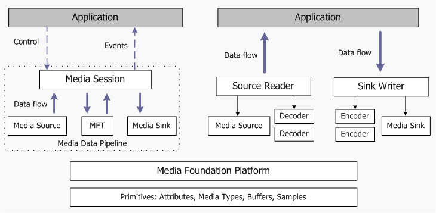

# 미디어 파운데이션 구조 개요

이번 주제에서는 마이크로소프트 미디어 파운데이션에 대한 전반적인 설계에 대해 설명한다. 미디어 파운데이션을 사용한 특정 프로그래밍 작업과 관련하여 보다 많은 정보는 [미디어 파운데이션 프로그래밍 가이드](https://docs.microsoft.com/en-us/windows/desktop/medfound/media-foundation-programming-guide)를 참고하는 것이 좋다.

다음 다이어그램은 고수준의 미디어 파운데이션 구조를 보여주고 있다.



미디어 파운데이션은 두 가지 구별되는 프로그래밍 모델을 제공한다.

 1. 다이어그램의 왼쪽에 위치해 있는 모델은 미디어 데이터에 대해 종단 간의 파이프라인을 사용한다. 애플리케이션은 파이프라인을 초기화 한 다음 (가령, 재생에 필요한 파일의 URL을 제공하여 초기화) 스트리밍을 제어하기 위해 메소드를 호출한다.
 2. 다이어그램의 오른쪽에 위치해 있는 모델에서 애플리케이션은 근원지(source)에서 데이터를 받거나 아니면 목적지로 데이터를 전송한다. (둘 다 할 수도 있다.) 이 모델은 특히 사용자가 데이터를 저리할 필요가 있을 경우 유용한데, 왜냐하면 이 애플리케이션은 데이터 스트림으로 직접 접근할 수 있기 때문이다.

## 기본 요소와 플랫폼

다이어그램의 하단에 위치해있는 구성부터 시작하자면, *기본요소(primitives)*는 미디어 파운데이션 API 전반에 사용되는 헬퍼 객체이다.

 * 속성(Attributes) : 일련의 키-값 쌍으로, 객체 안에서 정보를 저장하는 일반적인 방식이다.
 * 미디어 타입(Medea Types) : 미디어 데이터 스트림의 서식(format)을 나타낸다.
 * 미디어 버퍼(Media Buffers) : 비디오 프레임이나 오디오 샘플과 같은 미디어 데이터 덩어리를 가지고 있으며, 객체 간 데이터 전송에 사용된다.
 * 미디어 샘플(Media Samples) : 미디어 버퍼에 대한 컨테이너이다. 미디어 샘플은 또한 타임 스탬프와 같은 버퍼에 대한 메타데이터를 포함하기도 한다.

[미디어 파운데이션 플랫폼 API](https://docs.microsoft.com/en-us/windows/desktop/medfound/media-foundation-platform-apis)는 비동기 콜백이나 작업 큐 등 미디어 파운데이션 파이프라인에서 사용하는 핵심 기능을 제공하고 있다. 어떤 애플리케이션은 이런 API를 직접 호출하고 싶을 수 있다. 또한, 우리가 미디어 파운데이션에 대한 커스텀 소스, 변환, 또는 싱크를 직접 구현할 때에 이런 API를 직접 호출해야 할 것이다.

## 미디어 파이프라인

미디어 파이프라인은 미디어 데이터를 생성하거나 처리하는 세 가지 종류의 객체를 포함하고 있다.

 * 미디어 소스 (Media Sources) : 파이프라인 안으로 데이터를 집어 넣는다. 이 때, 미디어 데이터는 비디오 파일과 같이 로컬에 저장되어 있는 파일이나 네트워크 스트림이나 하드웨어로 구현된 캡처 디바이스에서 얻을 수 있다.
 * 미디어 파운데이션 변환 (Media Foundation Transforms; MFTs) : 스트림에서 데이터를 처리한다. 인코더와 디코더가 MFTs로 구현된다.
 * 미디어 싱크 (Media Sinks) : 데이터를 실제 사용한다. 가령, 디스플레이에 비디오를 보여주거나, 오디오를 재생하거나, 아니면 미디어 파일로 데이터를 쓰는 작업을 수행한다.

서드 파티 모듈은, 이를테면 새로운 미디어 파일 포맷을 지원하기 위해 자신만의 커스텀 소스, 싱크, MFTs를 구현할 수 있다.

미디어 세션(Media Session)은 파이프라인에 걸쳐 데이터 흐름을 제어함과 동시에 품질 제어, 오디오 비디오간 동기화, 서식 변화에 응답하는 것 등의 작업을 처리한다.

## 소스 리더와 싱크 라이터

소스 리더(Source Reader)와 싱크 라이터(Sink Writer)는 기본적인 미디어 파운데이션 구성 요소 - 미디어 소스, 변환, 미디어 싱크 - 를 사용하는 다른 방법이다. 소스 리더는 미디어 소스와 0개 이상의 디코더를 다루는 주체이고, 싱크 라이터는 미디어 싱크와 0개 이상의 인코더를 다루는 주체이다. 미디어 소스로부터 압축된 (혹은 압축되지 않은) 데이터를 얻는 데 소스 리더를 사용할 수 있고, 마찬가지로 데이터를 인코딩하고 미디어 싱크로 전송하는 데 싱크 라이터를 사용할 수 있다.

```
중요 :

소스 리더와 싱크 라이터는 Windows 7에서 사용할 수 있다.

```

이러한 프로그래밍 모델은 애플리케이션이 데이터 흐름 전반에 보다 더 제어를 할 수 있도록 하며, 소스로부터 애플리케이션이 데이터를 직접 접근하게 할 수도 있다.

## 관련 주제

[미디어 파운데이션 : 필수 개념](https://docs.microsoft.com/en-us/windows/desktop/medfound/media-foundation-programming--essential-concepts)

[미디어 파운데이션 구조](https://docs.microsoft.com/en-us/windows/desktop/medfound/media-foundation-architecture)

## 원본

[Overview of the Media Foundation Architecture](https://docs.microsoft.com/en-us/windows/desktop/medfound/overview-of-the-media-foundation-architecture)